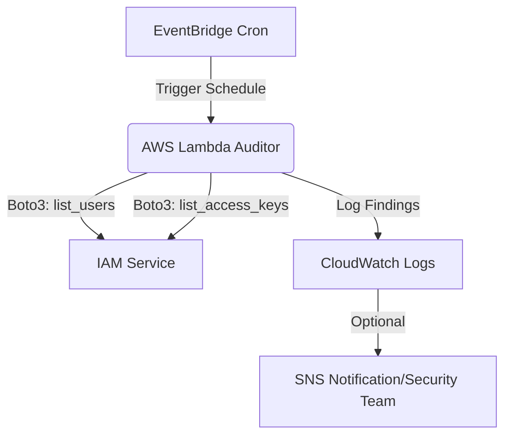

# AWS IAM Stale Access Key Auditor

## 🛡️ Project Overview
Security best practices (and frameworks like CIS) recommend rotating IAM Access Keys every 90 days. This project automates the auditing process by using an AWS Lambda function to scan all users in an AWS account and flag non-compliant credentials.

## 🏗️ Architecture Diagram

## 🛠️ Key Learnings
- **Identity Governance**: Managing the lifecycle of long-term credentials.
- **Python Datetime Logic**: Calculating time deltas to enforce compliance thresholds.
- **Auditing at Scale**: Understanding how to iterate through account-wide resources programmatically.

## 🚀 Future Improvements
- Auto-disabling keys older than 120 days.
- Integration with AWS SNS to send email alerts to users automatically.
